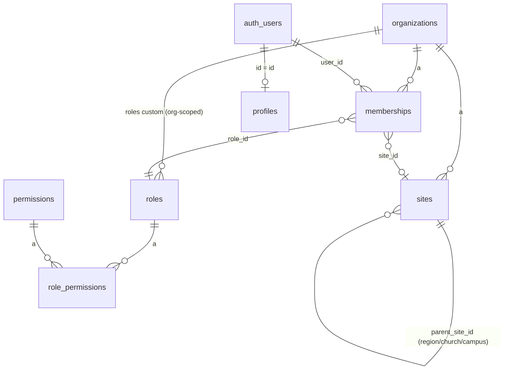

# Modèle de données — MAKAV ChurchOS

État après l'incrément 1 (`supabase/migrations/0001_tenancy_rbac.sql`, `0002_profiles_email.sql`). Mis à jour à chaque incrément.

## Diagramme (incrément 1)



## Tables

### `organizations`
Racine du tenant. `id, name, slug (unique), currency, timezone, plan, created_at`.

### `sites`
Hiérarchie auto-référencée `region → church → campus` (`parent_site_id`, `type` enum). L'incrément 1 ne crée que des sites `church` (siège autonome, `parent_site_id = null`), créés par la RPC `create_organization`. Le trigger `sites_validate_hierarchy` empêche dès maintenant les arbres invalides (un `campus` sans église parente, etc.) — nécessaire pour ne pas bloquer les régions/campus en P2/P3.

### `profiles`
Miroir de `auth.users` (`id` = même UUID). `full_name, avatar_url, locale, email` (dénormalisé — l'API REST/anon n'a pas accès au schéma `auth`). Créé automatiquement par le trigger `on_auth_user_created` → `handle_new_user()`.

### `roles`, `permissions`, `role_permissions`
Catalogue RBAC — voir `docs/architecture/rbac.md`.

### `memberships`
**La** table de multi-tenancy. `organization_id, user_id (nullable — null tant que l'invitation n'est pas acceptée), site_id, department_id (colonne présente, FK ajoutée à l'incrément 3), role_id, status (invited|active|suspended), invited_email`. Contrainte `user_id is not null or invited_email is not null`. Un index unique partiel empêche les invitations en double sur la même adresse tant qu'elles sont `invited`.

## RPC (`SECURITY DEFINER`)

- `create_organization(org_name, org_timezone, org_currency)` — crée organisation + site racine + membership `org_admin` pour l'appelant.
- `invite_member(target_org_id, member_email, target_role_code)` — crée une membership `invited`.
- `set_membership_role(target_membership_id, target_role_code)` / `set_membership_status(target_membership_id, new_status)` — modifient une membership existante.
- `is_org_member(org_id)` / `has_permission(org_id, perm_code)` — fonctions d'aide RLS, `STABLE`.

## Incrément 2 — Membres & Familles (`0003_members_families.sql`)

### `families`
`id, organization_id, site_id, name, head_member_id (nullable), created_at`.

### `members`
`id, organization_id, site_id, user_id (nullable — portail membre futur), family_id (nullable), family_role (head|spouse|child|dependent|other, nullable), first_name, last_name, email (unique par org), phone, birth_date, gender, member_status (active|visitor|inactive|transferred|deceased), join_date, photo_url, created_at`.

**Simplification par rapport au plan initial** : pas de table `family_members` — un membre appartient à au plus un foyer (`members.family_id` + `members.family_role`), pas de relation many-to-many. Le plan original avait `family_id` sur `members` ET une table de jointure `family_members`, ce qui modélisait une relation many-to-many sans cas d'usage réel en P1. Documenté ici pour ne pas la réintroduire par erreur.

**Piège PostgREST rencontré** : `families` et `members` ont deux relations FK (`members.family_id → families.id` et `families.head_member_id → members.id`). Toute requête qui *embed* `families(...)` depuis `members` (ou l'inverse) doit désambiguïser avec la syntaxe `!<nom_contrainte>` :

```ts
.select("id, first_name, families!members_family_id_fkey(name)")
```

Sans ce hint, PostgREST renvoie une erreur `PGRST201` ("more than one relationship was found") — silencieuse côté app si on ne vérifie pas `error` en plus de `data` (voir "Gotchas" dans `overview.md` : penser à logger/gérer `error` sur les requêtes embarquées, pas seulement déstructurer `data`).

### RLS
Standard `is_org_member`/`has_permission('members.write' | 'families.write')`, cohérent avec `docs/architecture/rbac.md`.

## Incrément 3 — Départements (`0004_departments.sql`)

### `departments`
`id, organization_id, site_id, parent_department_id (self-ref, nullable — sous-ministères), name, description, leader_member_id (nullable), created_at`. Contrainte unique `(organization_id, site_id, lower(name))`.

### `department_members`
Table de jointure many-to-many (contrairement à `members`/`families` — un membre peut appartenir à plusieurs départements). `department_id, member_id, role_in_department (head|assistant|member)`, clé primaire composite.

Complète `memberships.department_id` (colonne posée sans FK à l'incrément 1) avec la contrainte `memberships_department_id_fkey`, permettant enfin aux rôles `dept_head` scopés d'être rattachés à un vrai département.

### RLS
`departments` suit le pattern standard. `department_members` n'a pas de colonne `organization_id` directe — les policies passent par une sous-requête `exists (select 1 from departments d where d.id = department_members.department_id and ...)`.

## Incrément 4 — Événements & Calendrier (`0005_events.sql`)

### `event_types`
`id, organization_id, code, label_fr, color`. 4 types seedés par défaut à la création d'une organisation (via `seed_default_event_types()`, appelée par `create_organization`) : `culte`, `reunion`, `formation`, `repetition`, avec des couleurs alignées sur la palette du design system.

### `events`
`id, organization_id, site_id, department_id (nullable), event_type_id, title, description, location, starts_at, ends_at (timestamptz), all_day, capacity, status (scheduled|cancelled|completed), created_by, created_at`. Contrainte `ends_at >= starts_at`.

**Simplification par rapport au plan initial** : pas de colonne `recurrence_rule` (récurrence RRULE) ni `visibility` — non nécessaires pour un P1 sans UI de récurrence ni de visibilité différenciée.

**Fuseau horaire** : voir "Gotchas" dans `overview.md` — les timestamps sont saisis/affichés comme s'ils étaient en UTC partout dans l'app (`lib/format.ts`), sans conversion vers `organizations.timezone`. Limite P1 assumée.

### RLS
Standard `is_org_member`/`has_permission('events.write')`.

## Incrément 5 — Finances (`0006_finance.sql`)

`accounts`, `transaction_categories`, `transactions`, `expenses` + RPC `approve_expense`/`mark_expense_paid` + bucket Storage `receipts`. Détail complet dans `docs/architecture/finance.md` (modèle ledger, flux d'approbation, justificatifs).

## Incrément 6 — Dons (`0007_donations.sql`)

`donation_funds`, `donations`, `receipt_counters` + RPC `create_donation`/`next_receipt_number`. Détail complet dans `docs/architecture/finance.md`.

## Incrément 7 — Budgets (`0008_budgets.sql`, `0009_view_security_invoker.sql`)

`budgets`, `budget_lines`, vue `budget_line_actuals` (⚠️ `security_invoker = true`, voir `finance.md`), `budget_alerts_sent`, et `notifications` (créée à cet incrément, pas au suivant — le cron d'alertes en a besoin immédiatement). Détail complet dans `docs/architecture/finance.md`.

## Incrément 8 — Dashboard & notifications

Aucune nouvelle table (`notifications` créée à l'incrément 7). Ajoute :
- `(dashboard)/tableau-de-bord/page.tsx` — agrégation réelle (membres actifs, dons du mois, événements à venir, dépenses en attente d'approbation, liste des 5 prochains événements).
- Cloche de notifications (`(dashboard)/layout.tsx` + `_components/notification-bell-content.tsx`) — badge de compteur non lu, liste déroulante, marquage lu individuel/global (`notifications/actions.ts`).
- `notifications/page.tsx` — liste complète (jusqu'à 50).

Ceci complète le MVP Priorité 1 tel que défini dans le plan (9 incréments, tous terminés et vérifiés dans le navigateur).

## Groupes & Cellules (post-MVP, `0010_groups.sql`)

### `groups`
`id, organization_id, site_id, name, description, leader_member_id (nullable), meeting_day (nullable, lundi..dimanche — voir lib/validation/groups.ts), meeting_time (time, nullable), location, capacity (nullable), status (active|inactive), created_at`.

### `group_members`
Table de jointure many-to-many (même forme que `department_members`) : `group_id, member_id, role_in_group (leader|assistant|member), joined_at`, clé primaire composite.

**Distinction volontaire avec `departments`** : un département est un ministère de service (Louange, Accueil...) ; un groupe/cellule est une petite communauté de maison avec un horaire de rencontre récurrent. Structure de base dupliquée plutôt que réutilisée (pas de table commune) — les deux concepts sont indépendants et pourraient diverger (ex. suivi de présence par cellule en P2 sans impact sur les départements).

### `group_reports` (`0023_group_reports.sql`, détail par catégorie ajouté en `0024_group_reports_breakdown.sql`)
Rapport d'activité saisi par le responsable après une rencontre de cellule : `id, organization_id, site_id, group_id, meeting_date, theme (not null), women_count, men_count, teens_count, children_count, total_count (colonne générée = women+men+teens+children), new_people_count, new_births_count, notes (nullable), created_by, created_at`.

**0024 remplace `attendance_count` (un seul total) par le même détail par catégorie que `attendance_records`** (0022, module Statistiques) — demande explicite d'aligner la présence des cellules sur celle des cultes plutôt que de garder deux façons différentes de compter les présents. `new_people_count`/`new_births_count` restent des compteurs indépendants, non inclus dans `total_count` (une nouvelle personne est déjà comptée dans une des quatre catégories).

**UI intégrée à la fiche groupe, pas un module séparé** : carte "Rapports d'activité" sur `(dashboard)/groupes/[id]/page.tsx` (liste + lien "Nouveau rapport"), formulaire partagé création/édition sous `groupes/[id]/rapports/{nouveau,[reportId]/modifier}` — même structure que `pastoral-record-form.tsx` (un composant, `initialValues` optionnel).

**Aucun nouveau code de permission** : vit entièrement dans `groups.write` existant (0010), comme `addGroupMember`/`removeGroupMember`/`setGroupLeader`. La policy de lecture suit celle de `groups` elle-même — `is_org_member` seul, sans vérifier `groups.read` (ce code de permission est au catalogue mais n'est appliqué nulle part, y compris sur `groups` — voir juste en dessous).

### RLS et permissions
Même pattern que `departments`/`department_members` (policies via `is_org_member`/`has_permission('groups.write')`, `group_members` passe par une sous-requête sur `groups` faute de colonne `organization_id` directe). Nouvelles permissions `groups.read`/`groups.write` attribuées à `super_admin`, `org_admin`, `pastor` et `dept_head` (son `label_fr` mentionne explicitement "groupe").

## Suivi pastoral (post-MVP, `0011_pastoral_care.sql`)

### `pastoral_records`
`id, organization_id, site_id, member_id, category (visit|call|hospital|counseling|prayer_request|other), notes, status (open|in_progress|closed), follow_up_date (nullable), assigned_to (nullable, auth.users), created_by, created_at`.

**Permissions volontairement plus restrictives que le reste du module Communauté** : `pastoral_care.read`/`pastoral_care.write` ne sont attribuées qu'à `super_admin`, `org_admin` et `pastor` — **ni `dept_head` ni `finance_manager`**, contrairement à `groups.*`/`departments.*`. Cette exception directe applique le risque #5 identifié dans le plan initial : les notes pastorales sont des données sensibles qui ne doivent pas hériter de la même policy large que nom/téléphone sur `members`.

### `pastoral_appointment_slots` (`0025_pastoral_appointments.sql`)
Prise de rendez-vous avec un pasteur, self-service côté membre (`(member)/mon-espace/rendez-vous`) + gestion d'agenda côté staff (`(dashboard)/suivi-pastoral/rendez-vous`, nouvel onglet du module). `id, organization_id, site_id, pastor_user_id (auth.users, pas members — un pasteur est identifié par sa membership, pas forcément par une fiche membre), starts_at, ends_at, location (nullable), member_id (nullable), reason (nullable, saisi par le membre), status (open|requested|confirmed|completed), created_by, created_at`.

**Une seule table fait office de créneau ET de rendez-vous, comme `volunteer_slots` (0018)** : `member_id is null ⟺ status = 'open'` (contrainte check). Annuler (par le pasteur ou par le membre) ramène toujours le créneau à `open` (`member_id`/`reason` effacés) plutôt qu'un statut `cancelled` distinct — même choix que `volunteer_slots`, qui ne garde pas d'historique des désistements ; le pasteur réutilise le créneau plutôt que d'en recréer un.

**Confidentialité par pasteur, pas seulement par rôle — écart volontaire avec `pastoral_records`** : `pastoral_care.read/write` (0011) est accordé au rôle `pastor` dans son ensemble, donc deux pasteurs d'une même église se voient mutuellement dans le suivi pastoral. Ici, la demande explicite de confidentialité est appliquée au niveau de la ligne : la policy staff exige `pastor_user_id = auth.uid()` (le pasteur ne voit que ses propres créneaux) OU `has_permission(organization_id, 'organization.manage')` (org_admin/super_admin gardent une vue d'ensemble pour la supervision — permission jamais accordée au rôle `pastor` lui-même). Côté membre, même principe que le reste du portail (`donations_select_self`, 0020) : un membre voit les créneaux encore `open` (pour en choisir un) et **uniquement ses propres** rendez-vous, jamais ceux d'un autre membre.

**Pas de champ notes privées sur cette table** : ce besoin existe déjà, en mieux, via `pastoral_records` — déjà 100 % confidentiel côté pasteur et déjà lié à `member_id`. Le pasteur y logue une entrée après le rendez-vous plutôt que de dupliquer un champ ici, qui aurait demandé une visibilité différente du reste de la ligne (`reason` est saisi par le membre et doit au contraire rester visible aux deux parties).

**`pastoral_appointments.read`/`pastoral_appointments.write`** : nouvelles permissions, même périmètre que `pastoral_care.*` (`super_admin`, `org_admin`, `pastor` — ni `dept_head` ni `finance_manager`).

### `pastoral_appointment_managers` (`0026_pastoral_appointment_managers.sql`)
Table de délégation (pas un rôle RBAC global) : `organization_id, user_id, created_by, created_at`, clé primaire composite. Permet de désigner un "responsable des rendez-vous" (ex. secrétariat pastoral) qui peut gérer l'agenda de **tous** les pasteurs (créer des créneaux, confirmer, annuler) sans devenir `pastor` (ce qui ouvrirait aussi `pastoral_care.*`, `members.write`...) ni `org_admin` (tout le reste de l'organisation). Écriture réservée à `organization.manage` — décider qui gère l'agenda pastoral reste une décision d'administration, pas quelque chose qu'un pasteur pourrait s'accorder à lui-même. Fonction `is_pastoral_appointment_manager(org_id)` (même famille que `is_org_member`/`has_permission`), utilisée comme troisième voie d'accès dans les policies de `pastoral_appointment_slots` (en plus de "c'est mon créneau" et `organization.manage`).

**UI** : page dédiée `(dashboard)/suivi-pastoral/rendez-vous/gestion` (lien "Pasteurs & responsables" dans l'en-tête de la page Rendez-vous, visible seulement avec `organization.manage`). "Ajouter un pasteur" réutilise directement `changeMemberRole`/`set_membership_role` (déjà utilisée par `parametres/utilisateurs`) — **remplace** le rôle actuel du membre du staff, ce n'est pas un rôle additionnel (le modèle `memberships` ne supporte pas plusieurs rôles simultanés pour un même utilisateur dans une même organisation ; c'est prévu pour le multi-organisation, pas le multi-rôle intra-org — la page l'indique explicitement à l'utilisateur).

**Correctif de sécurité inclus dans 0026** : les policies staff insert/update de 0025 acceptaient `pastor_user_id = auth.uid()` seul comme condition suffisante, ce qui aurait permis à n'importe quel membre du staff (même sans le rôle `pastor`) de créer un créneau en se désignant lui-même comme pasteur. 0026 recrée ces policies en exigeant en plus `pastoral_appointments.write` sur cette branche précise (les branches `organization.manage` et manager délégué n'en ont pas besoin, gérer l'agenda d'autrui est justement leur rôle).

## Check-in enfants (post-MVP, `0012_checkin.sql`)

### `checkin_sessions`
`id, organization_id, site_id, event_id (nullable, rattachement optionnel à un culte/événement), child_member_id, guardian_name, guardian_phone (nullable), security_code, notes (allergies/instructions, nullable), checked_in_at, checked_in_by, checked_out_at (nullable), checked_out_by (nullable)`.

**Code de sécurité** : 4 chiffres partagés entre l'étiquette enfant et le talon parent (`app/checkin/[id]/etiquette/page.tsx`, page imprimable hors du groupe `(dashboard)`, même pattern que le reçu de don). Un index unique partiel `(organization_id, security_code) where checked_out_at is null` garantit qu'aucun code n'est ambigu parmi les enfants encore présents ; une fois récupéré, le code redevient disponible. Contrairement à la numérotation des reçus de dons (séquentielle, sans trou, via RPC), ce n'est pas un document légal — `createCheckin` (actions.ts) génère un code aléatoire et retente jusqu'à 8 fois en cas de collision (23505) plutôt que d'utiliser un compteur atomique dédié.

**Création d'enfant à la volée** : le formulaire de check-in permet de créer directement un membre (`family_role = 'child'`, `member_status = 'visitor'`) plutôt que d'exiger une fiche membre préexistante — geste central du workflow (accueil d'une famille visiteuse un dimanche matin). L'enfant créé reste ensuite une fiche `members` normale, éditable comme n'importe quel membre.

### RLS et permissions
Même pattern que `groups.*` : `checkin.read`/`checkin.write` attribuées à `super_admin`, `org_admin`, `pastor` et `dept_head` (activité opérationnelle pilotée au niveau département, pas une donnée sensible comme le suivi pastoral).

## Bénévoles & plannings (post-MVP, `0018_volunteer_scheduling.sql` + `0018b_volunteer_permissions_fix.sql`)

**0018b** existe parce que le premier passage collé dans le SQL Editor Supabase s'est arrêté avant les deux derniers blocs `insert` (table + RLS appliquées, permissions absentes) — vérifié en interrogeant `permissions`/`role_permissions` avec la service role key. 0018b rejoue juste ces inserts avec `on conflict do nothing`, sûr à exécuter même si une partie était déjà passée.

### `volunteer_slots`
`id, organization_id, site_id, department_id, service_date (date), member_id (nullable), status (vacant|pending|confirmed), position_order, created_by, created_at`. Contrainte `member_id is null ⟺ status = 'vacant'`.

**Pas de nouvelle notion d'équipe** : la grille "Équipe × dimanche" affichée par `(dashboard)/benevoles/page.tsx` réutilise `departments` comme lignes (déjà défini comme "ministère de service — Louange, Accueil..." à l'incrément 3) et `department_members` comme réservoir de bénévoles éligibles par équipe. Une cellule vide (aucune ligne `volunteer_slots`) et un poste vacant explicite (ligne avec `member_id null`) sont volontairement distincts — le second est une action délibérée d'un responsable ("il nous faut quelqu'un ici"), pas un état calculé.

**Pas de récurrence ni de plage de dates configurable en P1** : la page calcule les 4 prochains dimanches glissants côté serveur (`nextSundays()`) plutôt que de stocker un calendrier de services — plus simple tant qu'il n'y a pas de besoin de planifier au-delà d'un mois.

**Relance des non-confirmés** : action `relancerNonConfirmes` (in-app uniquement, table `notifications` existante depuis l'incrément 7) — notifie les bénévoles `status = 'pending'` à venir. Silencieusement ignoré pour les membres sans `user_id` (pas de portail membre lié), plutôt que de bloquer la relance groupée.

### RLS et permissions
Pattern standard `is_org_member`/`has_permission`. `volunteers.read`/`volunteers.write` attribuées à `super_admin`, `org_admin`, `pastor`, `dept_head`, et au rôle `volunteer_manager` ("Responsable RH / bénévoles", seedé dès l'incrément 1 mais resté sans permission câblée jusqu'ici — c'est exactement son périmètre).

## Communication (post-MVP, `0019_communication.sql`)

### `communications`
`id, organization_id, site_id, channel (app|email|sms), title, body, segment_summary (texte affiché dans l'historique), segments (jsonb — [{type, id, label}], rejoué par le cron pour les envois programmés), recipient_count, status (scheduled|sent), scheduled_at, sent_at, created_by, created_at`.

**Un seul canal réellement branché en P1** : `app` (notifications in-app, table existante depuis l'incrément 7). Email et SMS sont visibles dans le composeur (`(dashboard)/communication/communication-composer.tsx`) mais désactivés (`ACTIVE_CHANNELS` dans `lib/validation/communications.ts`) — décision explicite du 2026-08-12 : le Marketplace Vercel n'a pas de fournisseur SMS natif, et l'installation de Resend (email) a été abandonnée en cours de route (acceptation des conditions + domaine `resend.dev` non finalisés côté dashboard). Pour activer l'un ou l'autre plus tard : provisionner le fournisseur, ajouter le canal à `ACTIVE_CHANNELS`, brancher l'envoi réel dans `dispatchApp`-like function.

**Pas de table de segments dédiée** : les segments (département, site/campus, "tous les membres") sont résolus à la volée à partir de `departments`/`sites`/`members` existants, à chaque envoi immédiat et à chaque exécution du cron pour les envois programmés — seul le résultat lisible (`segment_summary`) et la définition structurée (`segments` jsonb) sont persistés, pas la liste de membres elle-même (qui peut changer entre programmation et échéance).

**`notifications.communication_id`** (nullable, ajoutée par cette migration) : rattache les notifications créées par un envoi "app" à leur campagne d'origine, ce qui permet de calculer un vrai taux de lecture (`read_at`) par campagne dans l'historique, sans table de jointure séparée. Les notifications hors communication (ex. `budget_alert`, `volunteer_reminder`) laissent cette colonne `null`.

**Limite connue** : seuls les membres avec un `user_id` lié (portail membre) reçoivent réellement une notification — `recipient_count` reflète le segment complet, l'historique affiche séparément "notifiés"/"lus" à partir des lignes `notifications` effectivement créées. Même compromis que `relancerNonConfirmes` (module Bénévoles, `0018`).

**Envois programmés** : cron `/api/cron/send-communications` (toutes les 15 min, voir `vercel.ts`) — même pattern que `budget-alerts` (client service-role, `CRON_SECRET`).

### RLS et permissions
Pattern standard. `communications.read`/`communications.write` attribuées à `super_admin`, `org_admin`, `pastor`, et au rôle `communications_manager` ("Responsable communication", seedé dès l'incrément 1 mais resté sans permission câblée jusqu'ici — même situation que `volunteer_manager` en 0018).

## App membre (post-MVP, `0020_member_portal.sql`)

Portail self-service séparé du shell staff, pour les personnes ayant une fiche `members` (pas forcément une `memberships` staff). Le même compte `auth.users` peut être staff **et** membre simultanément — pas d'exclusivité.

**Aucune nouvelle table.** Uniquement des policies RLS *additives* (permissives : elles s'additionnent en OR aux policies `is_org_member` existantes, voir `overview.md`) qui ouvrent l'accès "à mes propres données" sur `members` (self), `donations` (les siens, via `member_id`), `events` (lecture, tout l'org), `groups`/`group_members` (ses propres groupes uniquement). `notifications` n'a rien eu à changer : sa policy `user_id = auth.uid()` (posée en 0008 pour la cloche staff) sert telle quelle de canal du portail.

**Portée volontairement restreinte** pour ce premier incrément :
- Pas de vue "roster" du groupe (les autres membres d'un même groupe ne sont pas exposés à un pair — `group_members_select_self` ne renvoie que la ligne du membre lui-même, décision produit à trancher explicitement avant d'élargir).
- Pas d'inscription en ligne aux événements — cohérent avec `event_registration_tracks` (0014, compteur géré par le staff).
- Pas de vue famille.
- Auto-édition limitée au téléphone (`updateMemberPhone`).

**Réclamation de compte** : `handle_new_user()` (trigger `on_auth_user_created`, 0001/0002) étendu pour aussi rattacher toute fiche `members` non réclamée dont l'email correspond — même mécanisme que la réclamation des `memberships` staff invitées. **Pas de fiche créée automatiquement** : un visiteur qui s'inscrit sur `/mon-espace/inscription` sans fiche membre préexistante (créée par le staff via le module Membres) obtient un compte authentifié mais orphelin ; `(member)/mon-espace/layout.tsx` détecte ce cas (`getMemberSession()` retourne `null` alors qu'un `user` existe) et affiche un message explicite plutôt qu'une boucle de redirection.

**Routes** : `(member-auth)/mon-espace/{connexion,inscription}` (publiques, ajoutées à `PUBLIC_PATHS` dans `lib/supabase/proxy.ts`) + `(member)/mon-espace/*` (gardées par `getMemberSession()`). Le proxy exempte explicitement `/mon-espace/*` de la vérification d'onboarding staff (`needsOnboardingCheck`) — un membre n'a pas vocation à avoir de `memberships` active, cette vérification l'aurait sinon renvoyé en boucle vers `/inscription/organisation`.

**Effet de bord utile** : les notifications envoyées par `relancerNonConfirmes` (module Bénévoles, 0018) et `sendCommunication`/`send-communications` (module Communication, 0019) pointaient vers des routes staff (`/benevoles`, `/communication`) — inutilisables par leurs destinataires réels (des `members`, pas forcément staff). Repointées vers `/mon-espace/notifications` dans ce même incrément.

## Recherche globale (2026-08-12)

`app/(dashboard)/_components/global-search-actions.ts` — pas de moteur full-text dédié, `ilike` sur les champs les plus consultés (membres, dons via `receipt_number`, événements, groupes, départements), 5 résultats/catégorie. UI en command palette (`cmdk`, déjà dans `components/ui/command.tsx` mais jamais utilisé avant) — penser à toujours envelopper `CommandInput`/`CommandList` dans un `<Command shouldFilter={false}>` (le filtrage cmdk intégré ferait doublon avec le filtrage serveur déjà appliqué), sans quoi `CommandInput` lève une erreur runtime (`Cannot read properties of undefined (reading 'subscribe')`) — `CommandDialog` ne fournit pas ce contexte lui-même.

## Multi-site / sélecteur de campus (2026-08-12)

Aucune nouvelle table (`sites` existe depuis 0001, capable de hiérarchie région/église/campus — seule une église racine par organisation était créée jusqu'ici). Ajouts :
- `app/(dashboard)/parametres/sites/` — CRUD basique (créer un campus rattaché à l'église racine, activer/désactiver) derrière `organization.manage` (déjà dans le catalogue de permissions, aucune migration nécessaire).
- Cookie `active_site_id` (`lib/session.ts`) + `switchSite` (`(dashboard)/actions.ts`) + `SiteSwitcher` dans la barre latérale, sous l'`OrgSwitcher` — même pattern que `active_organization_id`.
- **Point d'entrée unique** : `getDefaultSiteId()` (`lib/sites.ts`) lit désormais le cookie du site actif au lieu de toujours prendre le premier site créé — comme c'est la fonction utilisée par *toutes* les Server Actions de création (membres, événements, départements, groupes, bénévoles, check-in…), ce seul changement fait respecter le site actif partout sans toucher chaque action individuellement.
- **Lecture filtrée par site actif, pour l'instant seulement** : Tableau de bord (membres actifs, événements à venir) et liste Membres. Tous les autres modules restent org-wide (leur `site_id` existe déjà en base, prêt pour le même traitement plus tard). Finances/Dons/Budgets restent délibérément org-wide — pas de décision produit sur une trésorerie séparée par campus.

## i18n / bascule FR-EN (2026-08-12)

Pas de librairie i18n — un cookie `locale` (`lib/i18n/locale.ts`), un dictionnaire plat à clés pointées (`lib/i18n/dictionaries.ts`), un contexte React pour les Client Components (`lib/i18n/context.tsx`, `useTranslations()`) et un équivalent server-side pour les Server Components (`getDictionary()`, RSC ne peut pas consommer un contexte React). Pas de routes préfixées par locale (cohérent avec `overview.md`, convention "UI en français").

**Traduit intégralement** : chrome partagé (nav latérale, recherche globale, menu utilisateur) + Tableau de bord + Membres (page liste + `members-list.tsx`, colonnes de table comprises).
**Volontairement français uniquement pour l'instant** : tous les autres écrans, le contenu de la cloche de notifications (`NotificationBellContent`, partagée avec le portail membre), et les options de statut partagées entre plusieurs modules (`MEMBER_STATUS_OPTIONS` etc.) — les traduire en cascade aurait dépassé la portée de ce passage. Étendre le dictionnaire + appeler `t()`/`useTranslations()` suffit à traiter un écran de plus, suivant le même pattern.

## Backoffice plateforme (post-MVP, `0021_backoffice.sql`)

Panneau d'administration de la plateforme (toutes les organisations), distinct du shell `(dashboard)` d'une église — nouveau groupe de routes `(backoffice)/backoffice/*`, shell visuel volontairement différent (thème sombre) pour qu'il soit impossible de confondre les deux contextes.

**Accès** : réservé au rôle `super_admin` (seedé depuis 0001, jamais câblé en UI avant cet incrément — aucun module ne le nécessitait). Nouvelle fonction SQL `is_super_admin()` (`security definer`, sans paramètre d'organisation — contrairement à `has_permission(org_id, code)`, un super_admin voit *toutes* les organisations). Policies additives (permissives, s'OR-combinent avec les policies org-scoped existantes) sur `organizations` (select + update, pour éditer `plan`), `sites`, `memberships`, `profiles`, `members` (select uniquement, sert au compteur plateforme).

**Défense en profondeur** : la garde `lib/backoffice/guard.ts` (`requireSuperAdmin()`, appelée par chaque page/action du groupe) *et* `lib/supabase/proxy.ts` (redirige `/backoffice/*` si `is_super_admin()` renvoie faux) revérifient la même chose que la RLS — cohérent avec le principe "RLS = frontière réelle, le reste = échouer tôt avec un message clair" (rbac.md).

**Aucune auto-attribution du rôle** : pas de bouton "promouvoir super_admin" nulle part dans le produit, délibérément — s'attribuer soi-même (ou attribuer à un tiers) le rôle qui donne accès à *toutes* les organisations ne doit pas être une action self-service. Se fait en base, manuellement :
```sql
update memberships set role_id = (select id from roles where code = 'super_admin')
where user_id = '<uuid auth.users>' and organization_id = '<uuid organizations>';
```

**Portée de ce premier passage** : vue d'ensemble (compteurs plateforme), liste des organisations, détail d'une organisation (sites, équipe staff, édition du plan — champ texte libre, aucun catalogue de plans/tarifs n'existe ailleurs dans le produit pour l'instant), recherche d'utilisateurs tous organismes confondus. Pas de suspension d'organisation, pas de journal d'audit des actions backoffice, pas de gestion fine des permissions depuis cette UI — tout ça resterait à construire si le besoin se précise.

## Statistiques de présence (post-MVP, `0022_attendance.sql`)

### `attendance_records`
`id, organization_id, site_id, event_id (nullable, rattachement optionnel à un culte/événement), service_date, label, women_count, men_count, teens_count, children_count, total_count (colonne générée = women+men+teens+children), new_people_count, notes (nullable), created_by, created_at`.

**Saisie manuelle, pas un dérivé du check-in** : `checkin_sessions` (0012) compte les enfants déposés à l'espace enfants, pas l'assemblée entière — ce module répond à un besoin distinct (compte-rendu global d'assistance par genre + nouvelles personnes, saisi par un accueil/pasteur après le culte), d'où une table séparée plutôt qu'une agrégation de `checkin_sessions`.

**`total_count` généré plutôt que saisi librement** : évite l'écart entre un total annoncé et la somme du détail par genre/tranche d'âge — exactement l'erreur de saisie que ce module sert à éviter. `new_people_count` reste une saisie indépendante (une nouvelle personne est déjà comptée dans une des catégories ci-dessus, ce n'est pas une catégorie supplémentaire qui s'additionnerait au total).

**Rattachement `events` optionnel** : comme pour le check-in, beaucoup d'églises ne créent pas d'entrée `events` pour un culte dominical récurrent — `service_date` + `label` libres (ex. "Culte du dimanche matin") restent le chemin principal, le lien vers un `events.id` existant est une commodité quand il existe déjà.

### RLS et permissions
Même pattern que `checkin.*` : `attendance.read`/`attendance.write` attribuées à `super_admin`, `org_admin`, `pastor` et `dept_head` (activité opérationnelle pilotée au niveau département/campus, pas une donnée sensible comme le suivi pastoral).

## Covoiturage (`0027_carpooling.sql`)

Module de mise en relation conducteurs/passagers pour les trajets liés aux cultes et événements. Portée MVP volontairement réduite (pas d'IA, de QR code, de fournisseur SMS, de géocodage/carte live ni de mode offline — voir liste "différé" en fin de section) suite à un cadrage explicite avec l'équipe produit.

### Double coquille (comme les rendez-vous pastoraux, 0025/0026)

Le module vit dans **deux** groupes de routes distincts, sur le même modèle que `pastoral_appointment_slots` :
- `(dashboard)/covoiturage/*` — supervision « responsable mobilité » (tous les trajets, incidents, chauffeurs déclarés, besoins non couverts, KPIs), gatée par les permissions `carpooling.read`/`carpooling.manage`.
- `(member)/mon-espace/covoiturage/*` — la surface réelle self-service : tout membre du portail peut proposer un trajet (devient conducteur) ou demander une place (devient passager), gatée uniquement par `getMemberSession()` — **aucune vérification de permission côté membre**, exactement comme `rendez-vous/actions.ts`. L'accès self-service passe entièrement par des policies RLS additives (`members.user_id = auth.uid()`), pas par le catalogue RBAC : un membre portail pur n'a typiquement aucune ligne `memberships` et ne "possède" donc aucune permission au sens staff, même si `carpooling.read`/`carpooling.participate` sont câblées aux rôles `member`/`visitor` pour la complétude du catalogue.

### Tables

`carpool_vehicles` (rattaché au membre propriétaire, **pas** de `site_id` — déviation volontaire par rapport à la convention générale, un véhicule appartient à une personne pas à un campus ; `plate_masked` uniquement, jamais la plaque en clair, masquage fait côté Server Action avant insert), `carpool_rides` (le trajet — `driver_member_id`, `vehicle_id`, `event_id` nullable, `departure_label`/`destination_label` en texte libre, `seat_capacity`/`seats_available`, préférences, `auto_confirm`, `recurrence_group_id` nullable), `carpool_ride_stops` (arrêts ordonnés, RLS via le trajet parent comme `event_service_items`), `carpool_ride_requests` (demandes de place), `carpool_ride_needs` ("j'ai besoin d'un trajet"), `carpool_driver_availabilities` ("je souhaite être chauffeur bénévole", une ligne par membre via `unique(organization_id, member_id)`), `carpool_incidents`.

**Une seule table `carpool_ride_requests`, pas de split demande/réservation** : même simplification que `volunteer_slots` (0018) et `pastoral_appointment_slots` (0025) — une ligne, un statut qui évolue (`pending → confirmed|declined|waitlisted`, puis `cancelled`), plutôt que le modèle à deux tables suggéré par le cahier des charges initial.

**Champs de lieu nommés `*_label`, pas `*_address`** : nommage délibérément générique pour qu'un futur passage géocodage puisse ajouter des colonnes `*_lat`/`*_lng` sans renommage — même logique que `events.location` aujourd'hui.

**Trajets récurrents = N lignes pré-générées côté application** (partageant un `recurrence_group_id`, plafonnées à `MAX_RECURRING_OCCURRENCES = 26`), pas de moteur RRULE en base — la Server Action `createRide` construit le tableau de lignes et fait un seul `insert` multi-lignes.

**Check-in passager = 2 colonnes sur `carpool_ride_requests`** (`checked_in_at`, `no_show`), pas de table dédiée comme `checkin_sessions` : ici chaque passager a déjà une ligne naturelle (sa demande), contrairement au check-in enfants qui n'a pas d'entité "inscription" préexistante à enrichir.

### Gestion atomique des places — RPC `SECURITY DEFINER`

Même précédent que `create_donation` (0007) : la logique de places (jamais de sur-réservation, jamais de `seats_available` négatif) est trop sensible à la concurrence pour être gérée par un `UPDATE` client sous RLS. Quatre fonctions `SECURITY DEFINER plpgsql`, chacune verrouillant la ligne `carpool_rides` concernée (`select ... for update`) avant de lire/écrire :
- `request_carpool_seat` — résout le passager depuis `auth.uid()`, statut résultant `confirmed`/`waitlisted`/`pending` selon `auto_confirm` et les places restantes, notifie le conducteur.
- `respond_carpool_request` — conducteur ou staff `carpooling.manage` uniquement, revérifie la capacité avant de confirmer.
- `cancel_carpool_request` — réincrémente les places si la demande annulée était confirmée, puis **promeut en boucle les demandes `waitlisted` les plus anciennes** tant que la capacité le permet (promotion synchrone déclenchée par l'annulation elle-même, pas de hold/expiration programmée — ça nécessiterait un mécanisme de tâche différée qui n'existe pas encore dans ce produit).
- `mark_carpool_request_checkin` — bascule `checked_in_at`/`no_show`, réservé au conducteur ou au staff.

`seat_capacity` est **immuable après création** en MVP (pas de flux "modifier la capacité d'un trajet déjà publié") — supprime toute la classe de bugs "recalculer les places confirmées face à une capacité qui rétrécit".

### Notifications

Aucune fonction/table dédiée — insert direct dans la table `notifications` partagée, comme tous les autres modules (`carpool_request_received`, `carpool_request_confirmed`/`_declined`, `carpool_waitlist_promoted`, `carpool_ride_cancelled`, `carpool_ride_delayed`, `carpool_ride_arrived`). Tous les `link` pointent vers `/mon-espace/covoiturage/...` — même leçon que documentée plus haut pour `relancerNonConfirmes`/`sendCommunication`. Pas de rappels programmés (J-1/H-2/H-0:30) en MVP : nécessiterait un mécanisme de cron (ex. Vercel Cron) absent du produit aujourd'hui.

### Intégration Événements

Pas de colonne ajoutée à `events` — un `CarpoolPanel` sur `evenements/[id]/page.tsx` interroge `carpool_rides.event_id` et affiche un lien filtré vers la vue staff, exactement comme `event_registration_tracks`/`event_service_items` ont été greffés après coup sur le module Événements.

### Différé (V2/V3)

IA (recommandation/prédiction), QR codes, fournisseur SMS (même lacune que documentée pour `communications.ACTIVE_CHANNELS`), géocodage/carte/distance live (Mapbox/Google Maps via le Marketplace Vercel — le nommage `*_label` laisse la place), mode offline/PWA, moteur de matching scoré, système de notation/confiance, impact CO2 estimé, rappels programmés (nécessite un cron), frais/remboursement kilométrique (nécessite une intégration comptable sur le modèle de `create_donation`).
