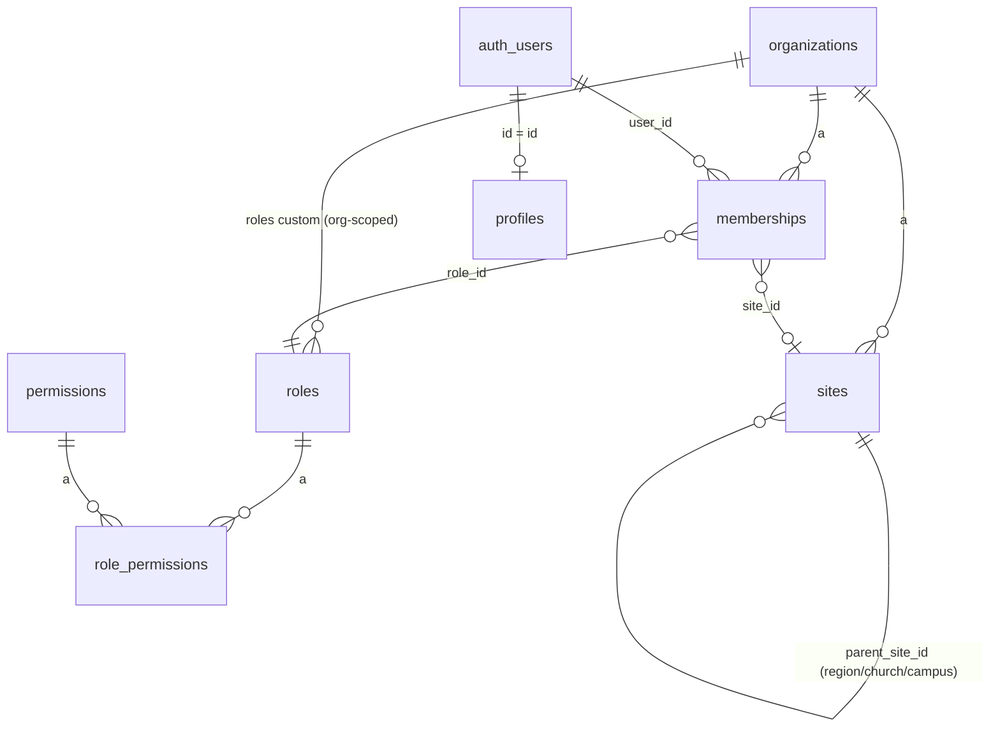

# Modèle de données — MAKAV ChurchOS

État après l'incrément 1 (`supabase/migrations/0001_tenancy_rbac.sql`, `0002_profiles_email.sql`). Mis à jour à chaque incrément.

## Diagramme (incrément 1)



## Tables

### `organizations`
Racine du tenant. `id, name, slug (unique), currency, timezone, plan, created_at`.

### `sites`
Hiérarchie auto-référencée `region → church → campus` (`parent_site_id`, `type` enum). L'incrément 1 ne crée que des sites `church` (siège autonome, `parent_site_id = null`), créés par la RPC `create_organization`. Le trigger `sites_validate_hierarchy` empêche dès maintenant les arbres invalides (un `campus` sans église parente, etc.) — nécessaire pour ne pas bloquer les régions/campus en P2/P3.

### `profiles`
Miroir de `auth.users` (`id` = même UUID). `full_name, avatar_url, locale, email` (dénormalisé — l'API REST/anon n'a pas accès au schéma `auth`). Créé automatiquement par le trigger `on_auth_user_created` → `handle_new_user()`.

### `roles`, `permissions`, `role_permissions`
Catalogue RBAC — voir `docs/architecture/rbac.md`.

### `memberships`
**La** table de multi-tenancy. `organization_id, user_id (nullable — null tant que l'invitation n'est pas acceptée), site_id, department_id (colonne présente, FK ajoutée à l'incrément 3), role_id, status (invited|active|suspended), invited_email`. Contrainte `user_id is not null or invited_email is not null`. Un index unique partiel empêche les invitations en double sur la même adresse tant qu'elles sont `invited`.

## RPC (`SECURITY DEFINER`)

- `create_organization(org_name, org_timezone, org_currency)` — crée organisation + site racine + membership `org_admin` pour l'appelant.
- `invite_member(target_org_id, member_email, target_role_code)` — crée une membership `invited`.
- `set_membership_role(target_membership_id, target_role_code)` / `set_membership_status(target_membership_id, new_status)` — modifient une membership existante.
- `is_org_member(org_id)` / `has_permission(org_id, perm_code)` — fonctions d'aide RLS, `STABLE`.

## Incrément 2 — Membres & Familles (`0003_members_families.sql`)

### `families`
`id, organization_id, site_id, name, head_member_id (nullable), created_at`.

### `members`
`id, organization_id, site_id, user_id (nullable — portail membre futur), family_id (nullable), family_role (head|spouse|child|dependent|other, nullable), first_name, last_name, email (unique par org), phone, birth_date, gender, member_status (active|visitor|inactive|transferred|deceased), join_date, photo_url, created_at`.

**Simplification par rapport au plan initial** : pas de table `family_members` — un membre appartient à au plus un foyer (`members.family_id` + `members.family_role`), pas de relation many-to-many. Le plan original avait `family_id` sur `members` ET une table de jointure `family_members`, ce qui modélisait une relation many-to-many sans cas d'usage réel en P1. Documenté ici pour ne pas la réintroduire par erreur.

**Piège PostgREST rencontré** : `families` et `members` ont deux relations FK (`members.family_id → families.id` et `families.head_member_id → members.id`). Toute requête qui *embed* `families(...)` depuis `members` (ou l'inverse) doit désambiguïser avec la syntaxe `!<nom_contrainte>` :

```ts
.select("id, first_name, families!members_family_id_fkey(name)")
```

Sans ce hint, PostgREST renvoie une erreur `PGRST201` ("more than one relationship was found") — silencieuse côté app si on ne vérifie pas `error` en plus de `data` (voir "Gotchas" dans `overview.md` : penser à logger/gérer `error` sur les requêtes embarquées, pas seulement déstructurer `data`).

### RLS
Standard `is_org_member`/`has_permission('members.write' | 'families.write')`, cohérent avec `docs/architecture/rbac.md`.

## Incrément 3 — Départements (`0004_departments.sql`)

### `departments`
`id, organization_id, site_id, parent_department_id (self-ref, nullable — sous-ministères), name, description, leader_member_id (nullable), created_at`. Contrainte unique `(organization_id, site_id, lower(name))`.

### `department_members`
Table de jointure many-to-many (contrairement à `members`/`families` — un membre peut appartenir à plusieurs départements). `department_id, member_id, role_in_department (head|assistant|member)`, clé primaire composite.

Complète `memberships.department_id` (colonne posée sans FK à l'incrément 1) avec la contrainte `memberships_department_id_fkey`, permettant enfin aux rôles `dept_head` scopés d'être rattachés à un vrai département.

### RLS
`departments` suit le pattern standard. `department_members` n'a pas de colonne `organization_id` directe — les policies passent par une sous-requête `exists (select 1 from departments d where d.id = department_members.department_id and ...)`.

## Incrément 4 — Événements & Calendrier (`0005_events.sql`)

### `event_types`
`id, organization_id, code, label_fr, color`. 4 types seedés par défaut à la création d'une organisation (via `seed_default_event_types()`, appelée par `create_organization`) : `culte`, `reunion`, `formation`, `repetition`, avec des couleurs alignées sur la palette du design system.

### `events`
`id, organization_id, site_id, department_id (nullable), event_type_id, title, description, location, starts_at, ends_at (timestamptz), all_day, capacity, status (scheduled|cancelled|completed), created_by, created_at`. Contrainte `ends_at >= starts_at`.

**Simplification par rapport au plan initial** : pas de colonne `recurrence_rule` (récurrence RRULE) ni `visibility` — non nécessaires pour un P1 sans UI de récurrence ni de visibilité différenciée.

**Fuseau horaire** : voir "Gotchas" dans `overview.md` — les timestamps sont saisis/affichés comme s'ils étaient en UTC partout dans l'app (`lib/format.ts`), sans conversion vers `organizations.timezone`. Limite P1 assumée.

### RLS
Standard `is_org_member`/`has_permission('events.write')`.

## Incrément 5 — Finances (`0006_finance.sql`)

`accounts`, `transaction_categories`, `transactions`, `expenses` + RPC `approve_expense`/`mark_expense_paid` + bucket Storage `receipts`. Détail complet dans `docs/architecture/finance.md` (modèle ledger, flux d'approbation, justificatifs).

## Incrément 6 — Dons (`0007_donations.sql`)

`donation_funds`, `donations`, `receipt_counters` + RPC `create_donation`/`next_receipt_number`. Détail complet dans `docs/architecture/finance.md`.

## Incrément 7 — Budgets (`0008_budgets.sql`, `0009_view_security_invoker.sql`)

`budgets`, `budget_lines`, vue `budget_line_actuals` (⚠️ `security_invoker = true`, voir `finance.md`), `budget_alerts_sent`, et `notifications` (créée à cet incrément, pas au suivant — le cron d'alertes en a besoin immédiatement). Détail complet dans `docs/architecture/finance.md`.

## Incrément 8 — Dashboard & notifications

Aucune nouvelle table (`notifications` créée à l'incrément 7). Ajoute :
- `(dashboard)/tableau-de-bord/page.tsx` — agrégation réelle (membres actifs, dons du mois, événements à venir, dépenses en attente d'approbation, liste des 5 prochains événements).
- Cloche de notifications (`(dashboard)/layout.tsx` + `_components/notification-bell-content.tsx`) — badge de compteur non lu, liste déroulante, marquage lu individuel/global (`notifications/actions.ts`).
- `notifications/page.tsx` — liste complète (jusqu'à 50).

Ceci complète le MVP Priorité 1 tel que défini dans le plan (9 incréments, tous terminés et vérifiés dans le navigateur).
